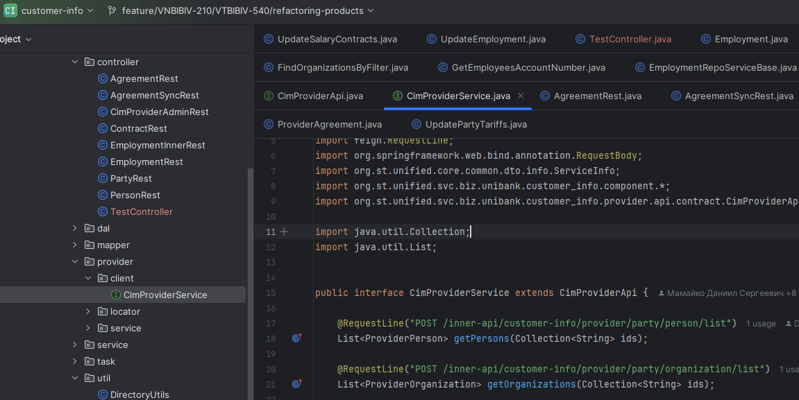
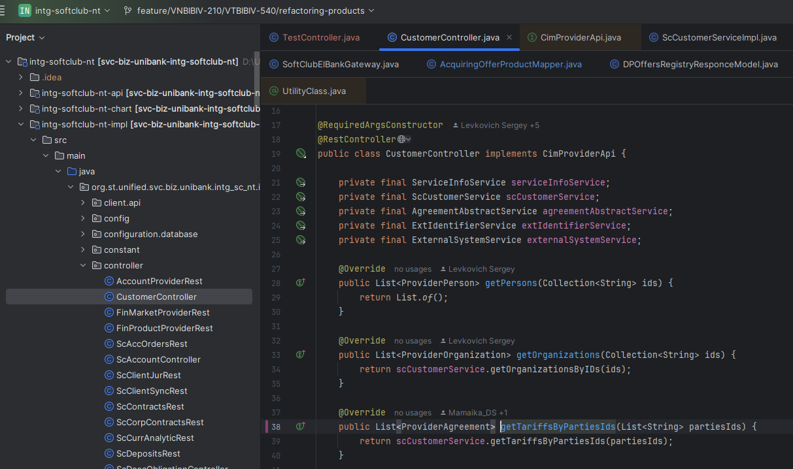

TODO: 

- model в impl для чего


**insurance-api**
---
Описывает общие api и модели, которые далее вызывают наши процессы/делегаты
Данные интерфейсы api реализуются в сервисе impl в папке controller

**insurance-provider-api**
---
Описывает api, к которым смогут обращаться другие сервисы приложения
Данный интерфейс реализуется в сервисе impl в папке provider.client

Далее в сервисе интегратора будет реализовываться интефейс, в котором будет прописана логика выполнения


**Тестовые cURL**
---
```
curl --location 'http://localhost:8031/api/insurances' \
--header 'Content-Type: application/json' \
--data '{
"policyNumber": "86485566",
"insuredEntity": "Mamaiko Daniil",
"coverageAmount": "18900"
}'
```